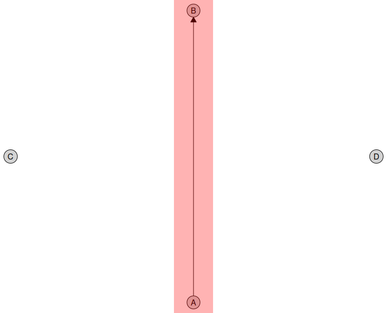

<!-- README.md is generated from README.Rmd. Please edit that file -->

```{r setup, include = FALSE}
knitr::opts_chunk$set(
  collapse = TRUE,
  comment = "#>",
  fig.path = "man/figures/README-",
  out.width = "100%"
)
```

# causalDisco 

<!-- badges: start -->
[](https://app.codecov.io/gh/BjarkeHautop/causalDisco)
[](https://github.com/BjarkeHautop/causalDisco/actions/workflows/R-CMD-check.yaml)
[](https://CRAN.R-project.org/package=causalDisco)
<!-- badges: end -->

causalDisco provides a unified interface for causal discovery on observational data.
It wraps multiple causal discovery backends under a common, consistent syntax. 

## Motivation

Causal discovery methods exist in many ecosystems, for example in bnlearn, pcalg, or Tetrad, but their APIs vary widely.

causalDisco unifies them under one clear grammar, making it easy to compare results, switch algorithms, and focus on scientific questions rather than package quirks.

Time to hit the disco 🪩

## Installation 

### Install causalDisco

To install causalDisco ensure you first have installed Rust as described below.

Then you can install the development version of causalDisco from GitHub using pak:

```{r install, eval=FALSE}
pak::pkg_install("https://github.com/BjarkeHautop/causalDisco")
```

or with all suggested packages (note that this requires a valid Java / JDK installation for rJava as described below):

```{r install w depend, eval=FALSE}
pak::pkg_install("https://github.com/BjarkeHautop/causalDisco", dependencies = TRUE)
```

### Installing Rust

causalDisco depends on the package [caugi](https://github.com/frederikfabriciusbjerre/caugi), which requires Rust to
be installed on your system. See https://www.rust-lang.org/tools/install for instructions on how to
install Rust.

### Installing Java / JDK

causalDisco provides an interface to the Java library [Tetrad](https://github.com/cmu-phil/tetrad) for
causal discovery algorithms. To use algorithms from Tetrad you need to install a Java Development Kit (JDK) >= 21.
We recommend Eclipse Temurin (OpenJDK), available at https://adoptium.net for all major operating systems.

Alternatively, we provide a helper function to install Temurin JDK 25 on macOS and Windows:

```{r install java, eval=FALSE}
causalDisco::install_java()
```

The current supported version of Tetrad can then be installed by calling

```{r install tetrad, eval=FALSE}
causalDisco::install_tetrad()
```

To verify everything is set up correctly you can run `check_tetrad_install()`:

```{r check tetrad install}
causalDisco::check_tetrad_install()
```

## Example

With causalDisco you can currently run causal discovery algorithms from the package causalDisco itself,
the Java library Tetrad, the R package bnlearn, and the R package pcalg.

```{r example}
library(causalDisco)

# load data
data(tpc_example)

# Define background knowledge object
kn <- knowledge(
  tpc_example,
  tier(
    child ~ starts_with("child"),
    youth ~ starts_with("youth"),
    old ~ starts_with("old")
  )
)

# Use Tetrad PC algorithm with conditional Gaussian test
# Requires Tetrad to be installed
if (check_tetrad_install()$installed && check_tetrad_install()$java_ok) {
  tetrad_pc <- pc(engine = "tetrad", test = "conditional_gaussian", alpha = 0.05)
  disco_tetrad_pc <- disco(data = tpc_example, method = tetrad_pc, knowledge = kn)

  # Similarly, one could do
  tetrad_pc <- tetrad_pc |> set_knowledge(kn)
  disco_tetrad_pc_new <- tetrad_pc(tpc_example)
}

# Use causalDisco's own tges algorithm with temporal BIC score
cd_tges <- tges(engine = "causalDisco", score = "tbic")
disco_cd_tges <- disco(data = tpc_example, method = cd_tges, knowledge = kn)
```

You can visualize the resulting causal graph using the `plot()` function:

```{r plot}
#| fig.alt: "A causal graph with the known tiers indicated by vertical positioning of the nodes."
plot(disco_cd_tges)
```

## Questions

- Added the datasets from the webtool (https://shiny.sund.ku.dk/zms499/causalDisco/) to the package, see
https://bjarkehautop.github.io/causalDisco/reference/index.html#example-datasets. Are these fine?
  - Add a Discrete – ordered factors dataset (bnlearn has tests arguments that works on that only).

- Updated getting started and knowledge vignettes based on the feedback. Anything missing?

- Remove or keep tests/scores not present in Tetrad interface? (They still work since we call Tetrad Java code directly, but they aren't in the Tetrad GUI).
So also likely to be removed from Tetrad in future versions?

These scores: `"basis_function_bic"`, `mag_degenerate_gaussian_bic`, `mixed_variable_polynomial`.

These tests: `chi_square`, `g_square`, `basis_function_lrt`, `probabilistic`.

- `use_for_mc` (Markov checker) argument and usage? Can't set it atm...

## TODO

- Rewrite add checks (numeric, logical, ...) using checkmate package. Some of the checks aren't working correctly
atm either (we check is.numeric on a vector - which won't work correctly). R converts `c(1, TRUE)` to a
numeric vector, so is.numeric returns TRUE, but we want to catch that.

- Improve plot (use caugi)

  - For new features that are hard to do in grid (which caugi uses), maybe just insert the image in ggplot?
  
A rough WIP is here, which colors a rectangle around A and B:

```{r plot wip, eval = FALSE}
# Make sure causalDisco is not loaded to avoid namespace conflicts with caugi
if ("package:causalDisco" %in% search()) {
  detach("package:causalDisco", unload = TRUE, character.only = TRUE)
}

library(caugi) # Needs recent version from GitHub
library(ggplot2)
library(ggplotify)
library(grid)

cg <- caugi(A %-->% B, C, D)
layout <- caugi_layout(cg)
print(layout)
layout$x <- c(0.5, 0.5, 0, 1)
layout$y <- c(0, 1, 0.5, 0.5)
print(layout)
plot_cg <- plot(cg, layout = layout)

# Wrap the grid plot as ggplot
gg <- as.ggplot(~grid.draw(plot_cg@grob))

# Add rectangle
gg +
  annotate(
    "rect",
    xmin = layout$x[1] - 0.05,
    xmax = layout$x[2] + 0.05,
    ymin = layout$y[1],
    ymax = layout$y[2],
    fill = "red",
    alpha = 0.3
  )
```


  
  - Implement a working `make_tikz` for these plots. See tikzDevice package, which can do it automatically from R plots:
  
```{r tikzDevice example, eval=FALSE}
# Make sure causalDisco is not loaded to avoid namespace conflicts with caugi
if ("package:causalDisco" %in% search()) {
  detach("package:causalDisco", unload = TRUE, character.only = TRUE)
}
library(caugi)
library(tikzDevice)
cg <- caugi(A %-->% B + C)
tikz("cg_plot.tex", width = 6, height = 4)
plot(
  cg,
  node_style = list(
    by_node = list(
      A = list(fill = "lightblue", col = "darkblue", lwd = 2),
      B = list(fill = "red")
    )
  )
)
dev.off()
```
  
If we want any changes we can modify the tikz code after generation.

- Make required work for our algorithms. It breaks when it internally calls `tpdag`, so look into that...

- In documentation of defaults for tests maybe add the underlying engine defaults if they differ?

- In tests (and examples) don't use `tpc_example` all the time and instead also use other datasets (e.g. num_data, cat_data, mix_data).
(this also avoids that we currently simulate data in tests when needing an e.g. numerical dataset).

- Add all algs/scores/tests from the backends (start with Tetrad). Check if we currently document ones we haven't
implemented yet.
  - Missing scores: `"Instance-specific Augmented SEM BIC Score"`. Get this error when implementing:
  `Error in .jcall("RJavaTools", "Ljava/lang/Object;", "invokeMethod", cl, : java.lang.NullPointerException: Cannot invoke "edu.cmu.tetrad.data.Knowledge.getTestingData()" because "this.knowledge" is null` (see branch `Add-isa-sem-bic-score-to-Tetrad`).
  
- Update evaluation and confusion metrics (use caugi?)

### Bugfixes

- Setting `mc = TRUE` (or `mc_test = TRUE`) errors in Tetrad.

- Setting `precompute_covariances = FALSE` errors in Tetrad. Remove the argument (or fix...).

- bnlearn has bug for old version of caugi. Fixed in PR #149 in caugi.

- Tried implementing it in the scores (e.g. `TemporalBdeu`) by giving it score -Inf if missing a required edge,
  but then it runs forever. I.e. adding the following to `local.score`
  
```{r attempted fix, eval = FALSE}
vertex_name <- colnames(pp.dat$data)[vertex]
req_parents <- kn$edges |>
dplyr::filter(status == "required", to == vertex_name) |>
dplyr::pull(from)

parent_names <- colnames(pp.dat$data)[parents]
missing_required <- !all(req_parents %in% parent_names)
if (missing_required) {
  return(-Inf)
}
```

The algorithm needs to be modified when having required edges, I think.

Should be easier to fix for test based algorithms? Just check if required edges are present after skeleton phase and add them if missing? (and forbid them from being removed in orientation phase). Look at fixedEdges in pcalg.

  - Look into how (if) possible to pass to pcalg.

- Piping as done above for Tetrad in the example section loses `$knowledge$tiers` information due to how
  builders/closures capture knowledge.

  - Fixing requires refactoring the disco_method builder design I think.

#### Tetrad issues

- Tetrad does not use required correctly in `fci` algorithm

```{r tetrad required bug}
if (check_tetrad_install()$installed && check_tetrad_install()$java_ok) {
  data(tpc_example)

  kn <- knowledge(
    tpc_example,
    child_x1 %-->% youth_x3
  )
  
  tetrad_fci <- fci(engine = "tetrad", test = "conditional_gaussian", alpha = 0.05)
  output <- disco(data = tpc_example, method = tetrad_fci, knowledge = kn)
  edges(output)
}
```

Fixed in unreleased version of Tetrad (see #1947 in Tetrad issues).

### Documentation 

- Make it clear in `?BnlearnSearch` (and similar for the others) that all algorithms aren't currently fully supported.

- List in documentation of `tfci`, ... what kind of graph it returns.

- Figure out how to not repeat the documentation of e.g. penalty discount in TetradSearch R6 class.

### CRAN TODO

- Update Description: field in DESCRIPTION to mention it wraps other packages, ...

## Bugs & requests

Bug reports and feature requests are welcome:

[open an issue](https://github.com/BjarkeHautop/causalDisco/issues).
