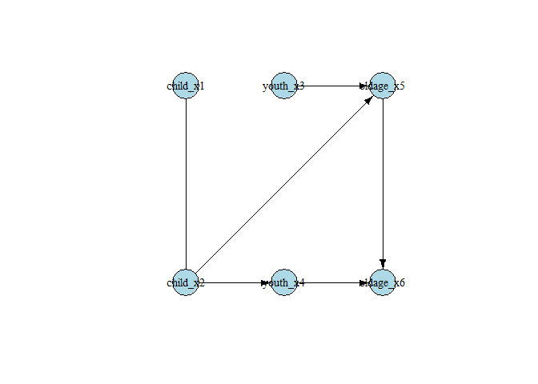

<!-- README.md is generated from README.Rmd. Please edit that file -->

# causalDisco 

<!-- badges: start -->

[](https://app.codecov.io/gh/BjarkeHautop/causalDisco)
[](https://github.com/BjarkeHautop/causalDisco/actions/workflows/R-CMD-check.yaml)
[](https://CRAN.R-project.org/package=causalDisco)
<!-- badges: end -->

`causalDisco` provides a unified interface for causal discovery on
observational data. It wraps multiple causal discovery backends under a
common, consistent syntax.

## Motivation

Causal discovery methods exist in many ecosystems, for example in
`bnlearn`, `pcalg`, or `Tetrad`, but their APIs vary widely.

`causalDisco` unifies them under one clear grammar, making it easy to
compare results, switch algorithms, and focus on scientific questions
rather than package quirks.

Time to hit the disco 🪩

## Installation

### Install `causalDisco`

Install the package from GitHub using `pak`:

``` r
pak::pkg_install("https://github.com/BjarkeHautop/causalDisco")
```

### Installing Rust

`causalDisco` depends on the package
[`caugi`](https://github.com/frederikfabriciusbjerre/caugi), which
requires Rust to be installed on your system. See [this
guide](https://www.rust-lang.org/tools/install) for instructions on how
to install Rust.

### Installing Java / JDK

`causalDisco` provides an interface to the Java library
[`Tetrad`](https://github.com/cmu-phil/tetrad) for causal discovery
algorithms. To use algorithms from `Tetrad` you need to install JDK 21
(or newer) [here](https://www.oracle.com/java/technologies/downloads/)
(or look at Tetrad’s [Java setup
guide](https://github.com/cmu-phil/tetrad/wiki/Setting-up-Java-for-Tetrad)).

The current supported version of `Tetrad` can then be installed by
calling

``` r
causalDisco::install_tetrad()
```

## Example

With `causalDisco` you can currently run causal discovery algorithms
from the packages `causalDisco` itself, the Java library `Tetrad`,
`bnlearn`, and `pcalg`.

``` r
library(causalDisco)
#> causalDisco startup:
#>   Java heap size requested: 2 GB
#>   Tetrad version: 7.6.8
#>   Java successfully initialized with 2 GB.
#>   To change heap size, set options(java.heap.size = 'Ng') or Sys.setenv(JAVA_HEAP_SIZE = 'Ng') *before* loading.
#>   Restart R to apply changes.

# load data
data("tpcExample")

# define background knowledge object
kn <- knowledge(
  tpcExample,
  tier(
    child ~ starts_with("child"),
    youth ~ starts_with("youth"),
    old ~ starts_with("old")
  )
)

# use Tetrad PC algorithm with conditional Gaussian test
tetrad_pc <- pc(engine = "tetrad", test = "conditional_gaussian", alpha = 0.05)
disco_tetrad_pc <- disco(data = tpcExample, method = tetrad_pc, knowledge = kn)

# similarly, one could do
tetrad_pc <- tetrad_pc |> set_knowledge(kn)
disco_tetrad_pc_new <- tetrad_pc(tpcExample)

# use causalDisco's own tges algorithm with temporal BIC score
cd_tges <- tges(engine = "causalDisco", score = "tbic")
disco_cd_tges <- disco(data = tpcExample, method = cd_tges, knowledge = kn)
```

You can visualize the resulting causal graph using the `plot()`
function:

``` r
plot(disco_cd_tges)
```



## TODO

- Tetrad does not use tier knowledge correctly yet.

- Our tges algorithm does not yet support forbidden/required edges from
  knowledge objects.

- Piping as done above for Tetrad loses $knowledge$tiers information.

- List of available tests for `pc` (and more probably)? Can see
  “conditional_gaussian”, “mi”, and “fisher_z” exists. What else? I
  guess the idea was to grab these from the engine dynamically?

- inst/roxygen-examples/TetradSearch_example.R fails for set.seed(16)
  (works for seed 1-15) with error:

``` r
# Error in .jcall("RJavaTools", "Ljava/lang/Object;", "invokeMethod", cl,  : 
#  java.lang.RuntimeException
```

Maybe v7.6.9 fixes it?

- Make vignettes

- Long term: Move to Tetrad v7.6.9 v7.6.9 removes this entire folder

<https://github.com/cmu-phil/tetrad/tree/v7.6.8/tetrad-lib/src/main/java/edu/cmu/tetrad/algcomparison/algorithm/cluster>

Was removed in this commit
<https://github.com/cmu-phil/tetrad/commit/295dceef6b83ac08ff0032fb194cf3ee5e429337#diff-adf829223cc59eac11682310f8a77c0ec3cf26a5b4310d75ec8edfaa86dd285b>

Changelog says “and a generalization of GFFC (Generalized Find Factor
Clusters) of FOFC and FTFC, providing multiple strategies for
discovering latent clusterings from measurement data.”

so we need to implement this in causalDisco (help?)

## Bugs & requests

Bug reports and feature requests are welcome:

👉 [open an issue](https://github.com/BjarkeHautop/causalDisco/issues).
