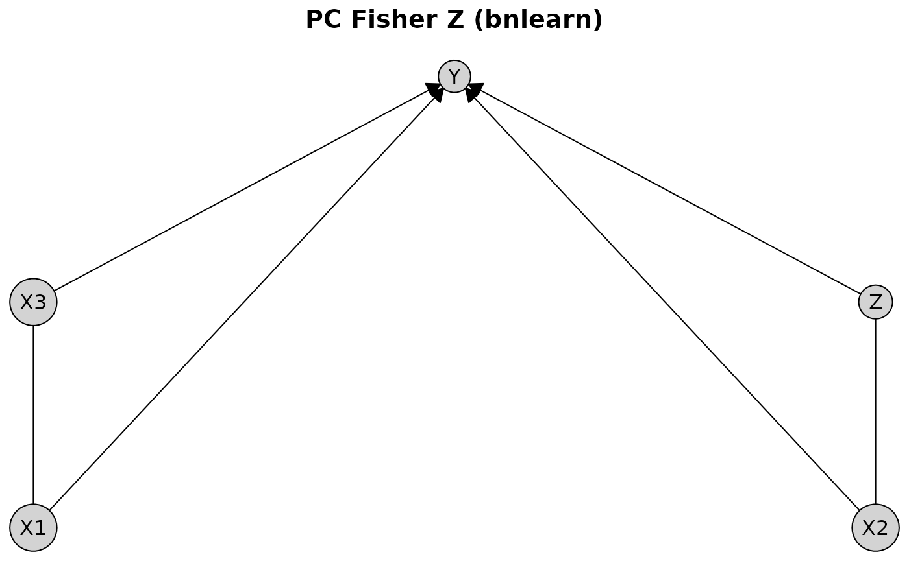

# causalDisco

``` r
library(causalDisco)
#> causalDisco startup:
#>   Java heap size requested: 2 GB
#>   Tetrad version: 7.6.10
#>   Java successfully initialized with 2 GB.
#>   To change heap size, set options(java.heap.size = 'Ng') or Sys.setenv(JAVA_HEAP_SIZE = 'Ng') *before* loading.
#>   Restart R to apply changes.
```

This vignette provides an overview of the causalDisco package, which
offers tools for causal discovery from observational data. It covers the
main features of the package, including various causal discovery
algorithms, knowledge incorporation, and result visualization.

## Running causal discovery algorithms

We will for this section use the `num_data` dataset included in the
package for demonstrating how to run causal discovery algorithms. It
contains 5 numerical variables, `X1, X2, X3, Z`, and `Y`.

``` r
data(num_data)
head(num_data)
#>         X1        X2       X3         Z        Y
#> 1 3.900715  7.048325 6.964806 10.272479 15.35505
#> 2 4.736112  6.236746 5.666022 10.357262 23.36749
#> 3 4.657992 12.169805 9.127046  9.138338 25.32495
#> 4 5.176469  6.392344 6.101088 10.808335 26.75643
#> 5 4.535538 10.305236 7.465185 10.612735 22.67612
#> 6 4.885914 10.018856 7.413312  9.375931 28.03132
```

To make the different causal graphs easier to interpret, we define a
custom fixed layout for plotting the results:

``` r
plot_layout <- data.frame(
  name = c("Z", "X3", "X1", "X2", "Y"),
  x = c(0.00, 0.50, 0.00, 0.50, 0.25),
  y = c(0.0, 0.0, 0.5, 0.5, 1.0)
)
```

To run a causal discovery algorithm, we first define the algorithm using
the corresponding function, and then pass it to the
[`disco()`](https://disco-coders.github.io/causalDisco/reference/disco.md)
function along with the data. Below we demonstrate this process using
the Peter-Clark (PC) algorithm from bnlearn with Fisher’s Z test:

``` r
pc_bnlearn <- pc(
  engine = "bnlearn", # Use the bnlearn implementation
  test = "fisher_z", # Use Fisher's Z test for conditional independence
  alpha = 0.05 # Significance level for the test
)
pc_result_bnlearn <- disco(data = num_data, method = pc_bnlearn)
```

We can visualize the results using
[`plot()`](https://disco-coders.github.io/causalDisco/reference/plot.md):

``` r
plot(pc_result_bnlearn, layout = plot_layout, main = "PC Fisher Z (bnlearn)")
```



The first notable feature of this plot is that some edges are directed,
while others are undirected. For example, the edge from `X1` to `Y` is
directed, indicating a causal effect of `X1` on `Y`. In contrast, the
edge between `X1` and `X3` is undirected, indicating that the data alone
do not provide sufficient information to determine the causal direction.
Both orientations `X1 %-->% X3` and `X3 %-->% X1` are compatible with
the observed conditional independencies.

To view all engines available for a specific algorithm, you can see the
documentation using
[`?pc`](https://disco-coders.github.io/causalDisco/reference/pc.md),
where all options are listed under the `engine` argument. Instead of
using bnlearn, we can also use the PC implementation from the pcalg
package with the same test:

``` r
pc_pcalg <- pc(
  engine = "pcalg", # Use the pcalg implementation
  test = "fisher_z", # Use Fisher's Z test for conditional independence
  alpha = 0.05 # Significance level for the test
)
pc_result_pcalg <- disco(data = num_data, method = pc_pcalg)
plot(pc_result_pcalg, layout = plot_layout, main = "PC Fisher Z (pcalg)")
```


We see that the results using the PC algorithm implemented in bnlearn
and pcalg gives the same output on this dataset.

You can also use a different algorithm altogether, such as the GES
algorithm. It follows the same pattern, however GES is a score-based
algorithm, so instead of a test and an alpha level, we need to specify a
score. Below we will use the Extended Bayesian Information Criterion
(EBIC) score from Tetrad.

Tetrad is written in Java, so to use it we first need to ensure that
Java is installed and that the Tetrad jar files are available. This can
be done using the
[`verify_tetrad()`](https://disco-coders.github.io/causalDisco/reference/verify_tetrad.md)
function. If they aren’t installed, we provide the helper functions
[`install_java()`](https://disco-coders.github.io/causalDisco/reference/install_java.md)
and
[`install_tetrad()`](https://disco-coders.github.io/causalDisco/reference/install_tetrad.md)
to set them up.

``` r
if (verify_tetrad()$installed && verify_tetrad()$java_ok) {
  ges_tetrad <- ges(
    engine = "tetrad", # Use the Tetrad implementation
    score = "ebic" # Use the EBIC score
  )
  ges_result_tetrad <- disco(data = num_data, method = ges_tetrad)
  plot(ges_result_tetrad, layout = plot_layout, main = "GES EBIC (Tetrad)")
}
```


If you want to customize the plot appearance further, you can pass
additional arguments to
[`plot()`](https://disco-coders.github.io/causalDisco/reference/plot.md).
For example, to change the appearance of the nodes, you can use the
`node_style` argument:

``` r
plot(
  pc_result_bnlearn,
  layout = plot_layout,
  main = "Customized plot",
  node_style = list(
    fill = "lightblue", # Fill color
    col = "darkblue", # Border color
    lwd = 2, # Border width
    padding = 4, # Text padding (mm)
    size = 1.2 # Size multiplier
  )
)
```


For more details on customizing plots and generating TikZ code for LaTeX
documents, see the [visualization
vignette](https://disco-coders.github.io/causalDisco/articles/visualization.md).

Instead of using
[`plot()`](https://disco-coders.github.io/causalDisco/reference/plot.md),
another way to view and analyze the results is to use the
[`print()`](https://rdrr.io/r/base/print.html) or
[`summary()`](https://rdrr.io/r/base/summary.html) functions:

``` r
print(pc_result_bnlearn)
#> 
#> ── caugi graph ─────────────────────────────────────────────────────────────────
#> Graph class: PDAG
#> 
#> ── Edges ──
#> 
#>   from  edge  to   
#>   <chr> <chr> <chr>
#> 1 X1    -->   Y    
#> 2 X1    ---   Z    
#> 3 X2    ---   X3   
#> 4 X2    -->   Y    
#> 5 X3    -->   Y    
#> 6 Z     -->   Y
#> ── Nodes ──
#>   name 
#>   <chr>
#> 1 X1   
#> 2 X2   
#> 3 X3   
#> 4 Z    
#> 5 Y
#> ── Knowledge object ────────────────────────────────────────────────────────────
summary(pc_result_bnlearn)
#> 
#> ── caugi graph summary ─────────────────────────────────────────────────────────
#> Graph class: PDAG
#> Nodes: 5
#> Edges: 6
#> 
#> ── Knowledge summary ──
#> 
#> Tiers: 0
#> Variables: 0
#> Required edges: 0
#> Forbidden edges: 0
#> 
#> ── Variables per Tier
```

## Incorporating knowledge

We will for this section use the dataset `tpc_example`, which contains
variables, which are measured at three different life stages: childhood,
youth, and old age.

``` r
data(tpc_example)
head(tpc_example)
#>   child_x2   child_x1    youth_x4 youth_x3  oldage_x6  oldage_x5
#> 1        0 -0.7104066 -0.07355602        1  6.4984994  3.0740123
#> 2        0  0.2568837 -1.16865142        1  0.3254685  1.9726530
#> 3        0 -0.2466919 -0.63474826        1  4.1298927  1.9666697
#> 4        1  1.6524574  0.97115845        0 -7.9064009 -4.5160676
#> 5        0 -0.9516186  0.67069597        0  1.7089134  0.7903853
#> 6        1  1.9549723 -0.65054654        0 -6.9758928 -3.2107342
```

Since we know the temporal ordering of the variables, we can incorporate
this background knowledge into the causal discovery algorithm.
Specifically, we know that variables measured in childhood cannot be
caused by variables measured in youth or old age, and variables measured
in youth cannot be caused by variables measured in old age.

Knowledge is encoded by creating a `knowledge` object via the
[`knowledge()`](https://disco-coders.github.io/causalDisco/reference/knowledge.md)
function. The first argument (optional, but recommended for name
matching) specifies the dataset. Tiered knowledge can then be defined
using the `tier()` function. Here, we illustrate this by creating a
tiered knowledge structure based on life stages:

``` r
kn <- knowledge(
  tpc_example,
  tier(
    child ~ c("child_x1", "child_x2"),
    youth ~ starts_with("youth"), # tidyselect helper; equivalent to c("youth_x3", "youth_x4")
    oldage ~ starts_with("oldage")
  )
)
```

For more details on how to define knowledge, see the [knowledge
vignette](https://disco-coders.github.io/causalDisco/articles/knowledge.md).

You can view the `Knowledge` object using
[`print()`](https://rdrr.io/r/base/print.html),
[`summary()`](https://rdrr.io/r/base/summary.html) or
[`plot()`](https://disco-coders.github.io/causalDisco/reference/plot.md):

``` r
print(kn)
#> 
#> ── Knowledge object ────────────────────────────────────────────────────────────
#> 
#> ── Tiers ──
#> 
#>   tier  
#>   <chr> 
#> 1 child 
#> 2 youth 
#> 3 oldage
#> ── Variables ──
#>   var       tier  
#>   <chr>     <chr> 
#> 1 child_x1  child 
#> 2 child_x2  child 
#> 3 youth_x3  youth 
#> 4 youth_x4  youth 
#> 5 oldage_x5 oldage
#> 6 oldage_x6 oldage
summary(kn)
#> ── Knowledge summary ──
#> Tiers: 3
#> Variables: 6
#> Required edges: 0
#> Forbidden edges: 0
#> 
#> ── Variables per Tier
#> child: 2 variables
#> oldage: 2 variables
#> youth: 2 variables
plot(kn, main = "Temporal Knowledge")
```


The plot displays vertical tiers, each enclosed in a shaded rectangle
and labeled with the corresponding tier name at the top.

We can then incorporate this knowledge into any algorithm like above. To
do so, you need to pass the `knowledge` object as an argument to the
[`disco()`](https://disco-coders.github.io/causalDisco/reference/disco.md)
function. Here we use the Temporal Peter-Clark (tpc) algorithm from
causalDisco with the regression-based information loss test:

``` r
tpc_method <- tpc(
  engine = "causalDisco", # Use the causalDisco implementation
  test = "reg" # Use the regression-based information loss test
)
tpc_result <- disco(data = tpc_example, method = tpc_method, knowledge = kn)
```

Similarly, we can view the results using
[`print()`](https://rdrr.io/r/base/print.html),
[`summary()`](https://rdrr.io/r/base/summary.html) or
[`plot()`](https://disco-coders.github.io/causalDisco/reference/plot.md):

``` r
print(tpc_result)
#> 
#> ── caugi graph ─────────────────────────────────────────────────────────────────
#> Graph class: PDAG
#> 
#> ── Edges ──
#> 
#>   from      edge  to       
#>   <chr>     <chr> <chr>    
#> 1 child_x1  -->   child_x2 
#> 2 child_x2  -->   oldage_x5
#> 3 child_x2  -->   youth_x4 
#> 4 oldage_x5 ---   oldage_x6
#> 5 youth_x3  -->   oldage_x5
#> 6 youth_x4  -->   oldage_x6
#> ── Nodes ──
#>   name     
#>   <chr>    
#> 1 child_x2 
#> 2 child_x1 
#> 3 youth_x4 
#> 4 youth_x3 
#> 5 oldage_x6
#> 6 oldage_x5
#> ── Knowledge object ────────────────────────────────────────────────────────────
#> ── Tiers ──
#> 
#>   tier  
#>   <chr> 
#> 1 child 
#> 2 youth 
#> 3 oldage
#> ── Variables ──
#>   var       tier  
#>   <chr>     <chr> 
#> 1 child_x1  child 
#> 2 child_x2  child 
#> 3 youth_x3  youth 
#> 4 youth_x4  youth 
#> 5 oldage_x5 oldage
#> 6 oldage_x6 oldage
summary(tpc_result)
#> ── caugi graph summary ─────────────────────────────────────────────────────────
#> Graph class: PDAG
#> Nodes: 6
#> Edges: 6
#> 
#> ── Knowledge summary ──
#> 
#> Tiers: 3
#> Variables: 6
#> Required edges: 0
#> Forbidden edges: 0
#> 
#> ── Variables per Tier
#> child: 2 variables
#> oldage: 2 variables
#> youth: 2 variables
plot(tpc_result, main = "TPC reg_test with Temporal Knowledge (causalDisco)")
```


Like before, the tiered knowledge is reflected in the plot layout, with
variables grouped by life stage. Additionally, you can customize the
plot appearance further by passing additional arguments to
[`plot()`](https://disco-coders.github.io/causalDisco/reference/plot.md).

## Next steps

For more information about how to incorporate knowledge, see the
[knowledge
vignette](https://disco-coders.github.io/causalDisco/articles/knowledge.md).

For more information about causal discovery, see the [causal discovery
vignette](https://disco-coders.github.io/causalDisco/articles/causal-discovery.md).

For more information about visualization options, see the [visualization
vignette](https://disco-coders.github.io/causalDisco/articles/visualization.md).
