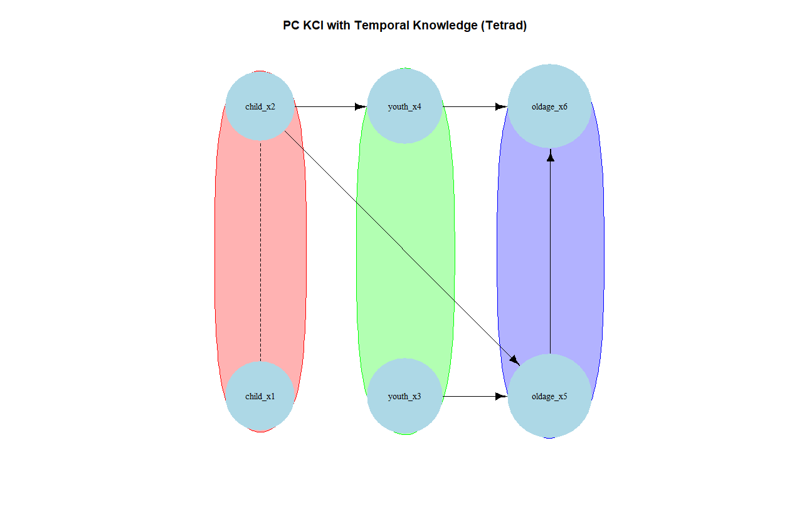

# causalDisco

``` r
library(causalDisco)
#> causalDisco startup:
#>   Java heap size requested: 2 GB
#>   Tetrad version: not installed
#>   Tetrad is not installed. Run install_tetrad() to install it.
#>   To change heap size, set options(java.heap.size = 'Ng') or Sys.setenv(JAVA_HEAP_SIZE = 'Ng') *before* loading.
#>   Restart R to apply changes.
```

This vignette provides an overview of the causalDisco package, which
offers tools for causal discovery from observational data. It covers the
main features of the package, including various causal discovery
algorithms, knowledge incorporation, and result visualization.

## Dataset

We will in this vignette use the `tpc_example` dataset available in the
package. This dataset contains simulated data from a known causal
structure, with a mix of continuous and categorical variables.

``` r
data("tpc_example")
# TODO change tpc_example to have child_x2 and youth_x3 as factors (or just use as numerical (or different dataset that isn't mixed))
tpc_example_cleaned <- tpc_example
tpc_example_cleaned$child_x2 <- as.factor(tpc_example_cleaned$child_x2)
tpc_example_cleaned$youth_x3 <- as.factor(tpc_example_cleaned$youth_x3)
head(tpc_example_cleaned)
#>   child_x2   child_x1    youth_x4 youth_x3  oldage_x6  oldage_x5
#> 1        0 -0.7104066 -0.07355602        1  6.4984994  3.0740123
#> 2        0  0.2568837 -1.16865142        1  0.3254685  1.9726530
#> 3        0 -0.2466919 -0.63474826        1  4.1298927  1.9666697
#> 4        1  1.6524574  0.97115845        0 -7.9064009 -4.5160676
#> 5        0 -0.9516186  0.67069597        0  1.7089134  0.7903853
#> 6        1  1.9549723 -0.65054654        0 -6.9758928 -3.2107342
```

We can use several algorithms from the `causalDisco` package to discover
the causal structure from this data. Here is an example using the
test-based PC algorithm from Tetrad with the Kernel Conditional
Independence Test (KCI), which can handle both continuous and
categorical variables.

``` r
if (check_tetrad_install()$installed && check_tetrad_install()$java_ok) {
  pc_tetrad <- pc(engine = "tetrad", test = "kci", alpha = 0.05)
  pc_result_tetrad <- disco(tpc_example_cleaned, method = pc_tetrad)
  plot(pc_result_tetrad, main = "PC KCI (Tetrad)")
}
```


We can also use a score-based method like GES with the BIC score for
basis-function models.

``` r
if (check_tetrad_install()$installed && check_tetrad_install()$java_ok) {
  ges_tetrad <- ges(engine = "tetrad", score = "basis_function_bic")
  ges_result_tetrad <- disco(tpc_example_cleaned, method = ges_tetrad)
  plot(ges_result_tetrad, main = "GES Basis Function BIC (Tetrad)")
}
```

 …

## Incorporating knowledge

Since our dataset contains variables measured at childhood, youth, and
old age, and thus the causal flow can’t go backwards in time. We can
incorporate this temporal knowledge into the causal discovery process.
This can be done as follows:

``` r
kn <- knowledge(
  tpc_example_cleaned,
  tier(
    child ~ starts_with("child"),
    youth ~ starts_with("youth"),
    oldage ~ starts_with("oldage")
  )
)
plot(kn)
```


We can then incorporate this knowledge into the PC algorithm as follows:

``` r
if (check_tetrad_install()$installed && check_tetrad_install()$java_ok) {
  pc_tetrad <- pc(engine = "tetrad", test = "kci")
  pc_result_with_knowledge <- disco(tpc_example_cleaned, method = pc_tetrad, knowledge = kn)
  plot(pc_result_with_knowledge, main = "PC KCI with Temporal Knowledge (Tetrad)")
}
```



We can see that the resulting graph respects the temporal ordering
specified in the knowledge object. We can also use other algorithms or
engines, such as the Temporal Peter-Clark (tpc) algorithm implemented in
this package with Regression-based information loss test:

``` r
tpc_method <- tpc(engine = "causalDisco", test = "reg")
tpc_result <- disco(tpc_example_cleaned, method = tpc_method, knowledge = kn)
plot(tpc_result, main = "TPC with Temporal Knowledge (causalDisco)")
```


## Next steps

For more information about how to incorporate knowledge, see the
[knowledge
vignette](https://bjarkehautop.github.io/causalDisco/articles/knowledge.md).

For more information about causal discovery, see the [causal discovery
vignette](https://bjarkehautop.github.io/causalDisco/articles/causal-discovery.md).

TODO: Use other engines
