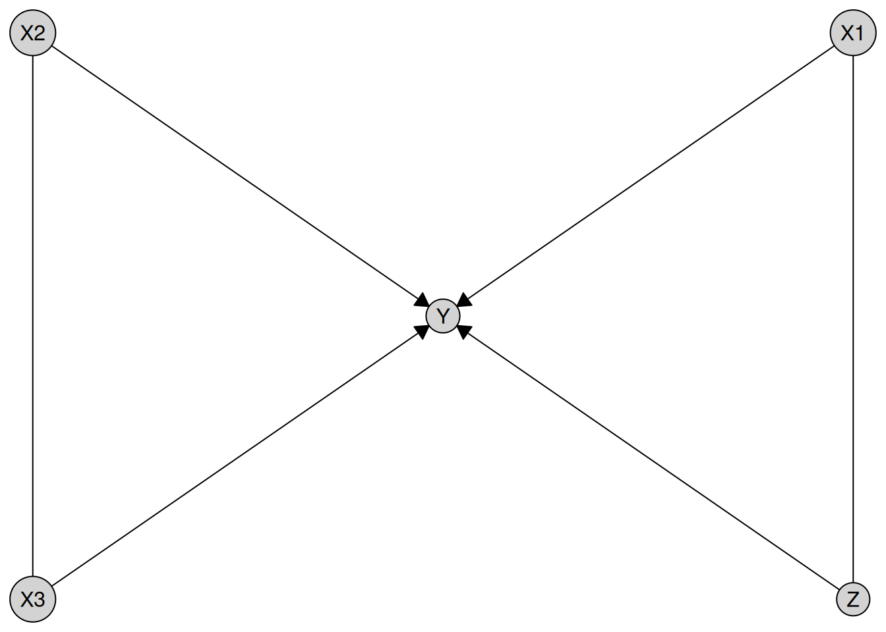

# Custom CI tests for causal discovery algorithms

``` r

library(causalDisco)
#> causalDisco startup:
#>   Java heap size requested: 2 GB
#>   Tetrad version: 7.6.10
#>   Java successfully initialized with 2 GB.
#>   To change heap size, set options(java.heap.size = 'Ng') or Sys.setenv(JAVA_HEAP_SIZE = 'Ng') *before* loading.
#>   Restart R to apply changes.
```

Please note, custom tests are experimental and subject to change to
improve usability and consistency across engines. We welcome feedback on
the current interface and suggestions for improvement.

This article illustrates how to use custom conditional independence
tests and custom scores with the
[`disco()`](https://disco-coders.github.io/causalDisco/reference/disco.md)
function in causalDisco. We show how to define user-specified tests and
scores, and how to run causal discovery using these custom functions.

Note that Tetrad-based algorithms do not currently support custom CI
tests, so this article will only cover the engines bnlearn, causalDisco,
and pcalg.

## Custom Tests

The interface for custom tests depends slightly on the engine being
used. causalDisco and pcalg use the exact same interface, while bnlearn
is slightly different for now. We plan to unify the interface across
engines in a future release.

### causalDisco and pcalg engines

A custom tests takes the signature
`function(x, y, conditioning_set, suff_stat, args)`, (`args` is an
optional). `x` and `y` are the variables being tested for independence,
`conditioning_set` is the conditioning set, and `suff_stat` is a list of
sufficient statistics needed for the test (e.g. correlation matrix and
sample size). The function should return a p-value indicating whether
`x` and `y` are conditionally independent given `conditioning_set`.

Of course the `suff_stat` argument could just be the raw data, but for
efficiency reasons, it is often better to precompute some sufficient
statistics.

An example of a custom CI test is a partial correlation test based on
the Fisher Z-transform, which can be implemented as follows:

``` r

my_test <- function(x, y, conditioning_set, suff_stat) {
  C <- suff_stat$C
  n <- suff_stat$n

  vars <- c(x, y, conditioning_set)
  C_sub <- C[vars, vars, drop = FALSE]
  K <- solve(C_sub)
  r <- -K[1, 2] / sqrt(K[1, 1] * K[2, 2])
  z <- 0.5 * log((1 + r) / (1 - r))

  stat <- sqrt(n - length(conditioning_set) - 3) * abs(z)

  pval <- 2 * (1 - pnorm(stat))

  pval
}

my_suff_stat <- function(data) {
  list(
    C = cor(data),
    n = nrow(data)
  )
}
```

This can then be used with the causalDisco engine as follows:

``` r

data(num_data)

my_tpc <- tpc(
  engine = "causalDisco",
  test = my_test,
  alpha = 0.05,
  suff_stat_fun = my_suff_stat
)
result <- disco(data = num_data, method = my_tpc)
plot(result)
```



or the pcalg engine as follows:

``` r

my_pc <- pc(
  engine = "pcalg",
  test = my_test,
  alpha = 0.05,
  suff_stat_fun = my_suff_stat
)
result <- disco(data = num_data, method = my_pc)
plot(result)
```


If the custom test requires additional arguments, then the function
signature should include an `args` parameter, i.e. be
`function(x, y, conditioning_set, suff_stat, args)`, and the additional
arguments can be passed as a list to the `args` parameter when defining
the method.

### bnlearn

For bnlearn the signature should be the same, but you must pass
`suff_stat/data` directly in the function, since bnlearn does not have a
way to precompute sufficient statistics and pass them to the test
function.

When defining a custom test for `bnlearn`, you can use either
`conditioning_set` and `suff_stat` **or** `z` and `data`, which are the
argument names bnlearn expects.

The test function should return either:

- A single numeric value (the p-value), **or**
- A numeric vector of length 2, where the **second element is the
  p-value**.

bnlearn requires the first element (the test statistic), but it is not
used. If you return only the p-value, a dummy statistic will be
automatically injected.

``` r

my_test_bnlearn <- function(x, y, conditioning_set, suff_stat, args = list()) {
  not_used <- args$not_used
  C <- cor(suff_stat)
  n <- nrow(suff_stat)

  vars <- c(x, y, conditioning_set)
  C_sub <- C[vars, vars, drop = FALSE]
  K <- solve(C_sub)
  r <- -K[1, 2] / sqrt(K[1, 1] * K[2, 2])
  z <- 0.5 * log((1 + r) / (1 - r))

  stat <- sqrt(n - length(conditioning_set) - 3) * abs(z)

  pval <- 2 * (1 - pnorm(stat))

  pval
}

my_pc <- pc(
  engine = "bnlearn",
  test = my_test_bnlearn,
  alpha = 0.05,
  args = list(not_used = "Example of passing additional arguments")
)
result <- disco(data = num_data, method = my_pc)
plot(result)
```


## Custom Scores

Not yet implemented, but will be added in a future release. Stay tuned
for updates on this feature!
