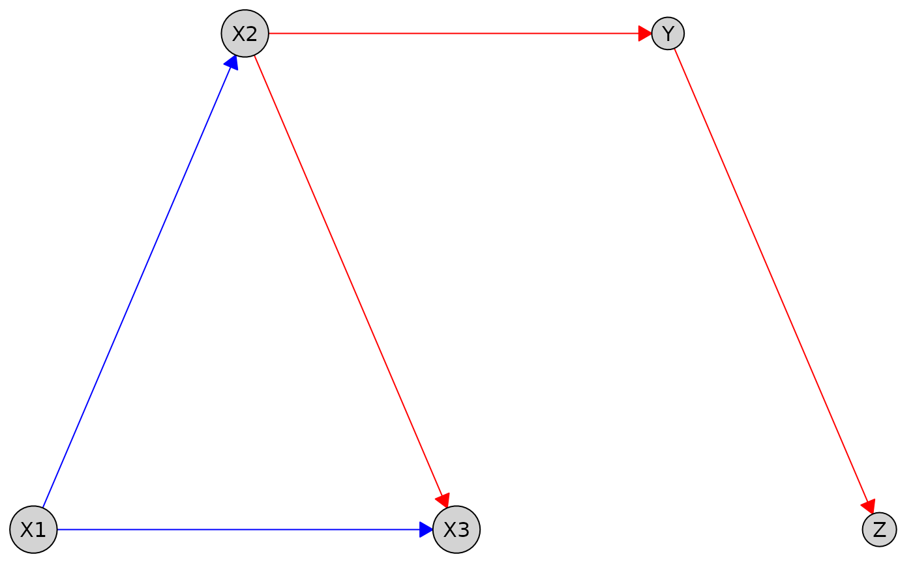

# Visualization

``` r
library(causalDisco)
#> causalDisco startup:
#>   Java heap size requested: 2 GB
#>   Tetrad version: 7.6.10
#>   Java successfully initialized with 2 GB.
#>   To change heap size, set options(java.heap.size = 'Ng') or Sys.setenv(JAVA_HEAP_SIZE = 'Ng') *before* loading.
#>   Restart R to apply changes.
```

This vignette demonstrates how to visualize causal graphs. We cover
plotting `knowledge` objects and `knowledgeable_caugi` objects,
customizing layouts and styles, and exporting graphs to readable TikZ
for inclusion and further customization in LaTeX documents.

## Plotting

You can visualize causal graphs using the
[`plot()`](https://disco-coders.github.io/causalDisco/reference/plot.md)
function, which works for both `knowledge` and `knowledgeable_caugi`
objects. The function leverages the underlying
[`caugi::plot()`](https://caugi.org/reference/plot.html) method,
providing flexible options for customizing the appearance of nodes and
edges.

### Plotting Knowledge Objects

We start by creating a simple `Knowledge` object and visualizing it with
[`plot()`](https://disco-coders.github.io/causalDisco/reference/plot.md).
This knowledge encodes the following relationships between variables in
our dataset:

``` r
data(num_data)
kn <- knowledge(
  num_data,
  X1 %-->% c(X2, X3), # Require edge from X1 to X2, and X1 to X3
  X2 %!-->% c(X3, Y), # Forbid edge from X2 to X3, and X2 to Y
  Y %!-->% Z  # Forbid edge from Y to Z
)

plot(kn)
```


By default, required edges are shown in blue and forbidden edges in red.
You can customize these colors using the `required_col` and
`forbidden_col` arguments:

``` r
plot(kn, required_col = "skyblue", forbidden_col = "orange")
```


Different node layouts, node styles, and edge styles can be specified
using the `layout`, `node_style`, and `edge_style` parameters. We
provide a quick example and refer to the
[`causalDisco::plot()`](https://disco-coders.github.io/causalDisco/reference/plot.md)
function (and the underlying
[`caugi::plot()`](https://caugi.org/reference/plot.html) function)
documentation for more details. Here we use the `"fruchterman-reingold"`
layout and customize node and edge styles:

``` r
plot(
  kn,
  layout = "fruchterman-reingold",
  node_style = list(
    fill = "lightblue", # Fill color
    col = "darkblue", # Border color
    lwd = 2, # Border width
    padding = 4, # Text padding (mm)
    size = 1.2 # Size multiplier
  ),
  edge_style = list(
    lwd = 1.5, # Edge width
    arrow_size = 4 # Arrow size (mm)
  ),
  required_col = "blue", # Color for required edges
  forbidden_col = "red" # Color for forbidden edges
)
```


Note that to override the colors for required and forbidden edges only
for a specific edge, the edge needs to be targeted explicitly in the
`by_edge` list of the `edge_style` argument. For example, to make the
required edge from `X1` to `X2` orange and the forbidden edge from `X2`
to `Y` yellow, while letting all other edges use the default colors, we
can do:

``` r
plot(
  kn,
  layout = "fruchterman-reingold",
  node_style = list(
    fill = "lightblue", # Fill color
    col = "darkblue", # Border color
    lwd = 2, # Border width
    padding = 4, # Text padding (mm)
    size = 1.2 # Size multiplier
  ),
  edge_style = list(
    lwd = 1.5, # Edge width
    arrow_size = 4, # Arrow size (mm)
    # Per-edge overrides
    by_edge = list(
      X1 = list(
        X2 = list(col = "orange", fill = "orange", lwd = 3)
      ),
      X2 = list(
        Y = list(col = "yellow", fill = "yellow", lwd = 3)
      )
    )
  ),
  required_col = "blue", # Color for required edges
  forbidden_col = "red" # Color for forbidden edges
)
```


You can also pass a custom layout to
[`plot()`](https://disco-coders.github.io/causalDisco/reference/plot.md):

``` r
my_layout <- data.frame(
  name = c("X1", "X2", "X3", "Y", "Z"),
  x = c(1, 2, 3, 4, 5),
  y = c(1, 2, 1, 2, 1)
)
plot(kn, layout = my_layout)
```



#### Plotting Tiered Knowledge

We can also visualize tiered knowledge structures. Here is an example
using a dataset with variables measured at different life stages:

``` r
data(tpc_example)
kn_tiered <- knowledge(
  tpc_example,
  tier(
    child ~ starts_with("child"), # tidyselect helper; equivalent to c("child_x1", "child_x2")
    youth ~ starts_with("youth"),
    old ~ starts_with("old")
  ),
  child_x1 %-->% child_x2,
  child_x2 %!-->% youth_x3
)
plot(kn_tiered)
```


Variables are grouped by life stage, reflecting the tiered structure.
This helps visually convey temporal or hierarchical relationships in the
data.

### Plotting Knowledgeable Caugi Objects

Here we run a causal discovery algorithm to get a `Disco` object, which
is the knowledge object alongside the learned causal graph as a `caugi`
object. We can then plot this combined object to see both the prior
knowledge and the learned relationships

``` r
data(num_data)
kn <- knowledge(
  num_data,
  X1 %-->% X2,
  X2 %!-->% c(X3, Y),
  Y %!-->% Z
)

pc_bnlearn <- pc(engine = "bnlearn", test = "fisher_z")
pc_result <- disco(num_data, method = pc_bnlearn, knowledge = kn)
plot(pc_result)
```


Blue edges indicate required relationships from prior knowledge, black
edges show those learned from the data, and forbidden edges are not
plotted (to avoid confusion and clutter).

With tiered knowledge, the plotting works similarly:

``` r
data(tpc_example)
kn_tiered <- knowledge(
  tpc_example,
  tier(
    child ~ starts_with("child"),
    youth ~ starts_with("youth"),
    old ~ starts_with("old")
  )
)
cd_tges <- tges(engine = "causalDisco", score = "tbic")
disco_cd_tges <- disco(data = tpc_example, method = cd_tges, knowledge = kn_tiered)
plot(disco_cd_tges)
```


Where we can see the tiers reflected in the layout of the graph.

## Exporting to TikZ

The
[`make_tikz()`](https://disco-coders.github.io/causalDisco/reference/make_tikz.md)
function exports plots as clean, fully editable TikZ code for inclusion
in LaTeX documents.

Unlike some graph export tools, edges are attached to nodes rather than
positioned using hard-coded coordinates, making the output easier to
modify.

This functionality works for `knowledge`, `knowledgeable_caugi`, and
[`caugi::caugi`](https://caugi.org/reference/caugi.html) objects,
allowing you to customize layouts, styles, and edges further in your
LaTeX document. It calls the underlying
[`causalDisco::plot()`](https://disco-coders.github.io/causalDisco/reference/plot.md)
method (which calls
[`caugi::plot()`](https://caugi.org/reference/plot.html)) to generate
the initial plot object before converting it to TikZ code. Thus, you can
supply any arguments to
[`make_tikz()`](https://disco-coders.github.io/causalDisco/reference/make_tikz.md)
that are supported by
[`causalDisco::plot()`](https://disco-coders.github.io/causalDisco/reference/plot.md)
and [`caugi::plot()`](https://caugi.org/reference/plot.html).

### Exporting Knowledge to TikZ

We first demonstrate TikZ export for a `knowledge` object.

``` r
data(num_data)
kn <- knowledge(
  num_data,
  X1 %-->% X2,
  X2 %!-->% c(X3, Y),
  Y %!-->% Z
)

# Full standalone document
tikz_knowledge_code <- make_tikz(kn, scale = 10, full_doc = TRUE)
cat(tikz_knowledge_code)
#> %%% Generated by causalDisco (version 0.9.5.9054)
#> \documentclass[tikz,border=2mm]{standalone}
#> \usetikzlibrary{arrows.meta, positioning, shapes.geometric, fit, backgrounds, calc}
#> 
#> \begin{document}
#> \tikzset{every node/.style={fill=lightgray}, every path/.style={draw=red}}
#> \tikzset{arrows={[scale=3]}, arrow/.style={-{Stealth}, thick}}
#> \begin{tikzpicture}
#> \node[draw, circle] (X1) at (1.667,0) {X1};
#> \node[draw, circle] (X2) at (1.667,3.333) {X2};
#> \node[draw, circle] (X3) at (3.333,6.667) {X3};
#> \node[draw, circle] (Y) at (0,6.667) {Y};
#> \node[draw, circle] (Z) at (0,10) {Z};
#> \path (X1) edge[draw=blue, -Latex] (X2)
#>       (X2) edge[, -Latex] (X3)
#>       (X2) edge[, -Latex] (Y)
#>       (Y) edge[, -Latex] (Z);
#> \end{tikzpicture}
#> \end{document}

# Only the tikzpicture environment
tikz_knowledge_snippet <- make_tikz(kn, scale = 10, full_doc = FALSE)
cat(tikz_knowledge_snippet)
#> %%% Generated by causalDisco (version 0.9.5.9054)
#> \tikzset{every node/.style={fill=lightgray}, every path/.style={draw=red}}
#> \tikzset{arrows={[scale=3]}, arrow/.style={-{Stealth}, thick}}
#> \begin{tikzpicture}
#> \node[draw, circle] (X1) at (1.667,0) {X1};
#> \node[draw, circle] (X2) at (1.667,3.333) {X2};
#> \node[draw, circle] (X3) at (3.333,6.667) {X3};
#> \node[draw, circle] (Y) at (0,6.667) {Y};
#> \node[draw, circle] (Z) at (0,10) {Z};
#> \path (X1) edge[draw=blue, -Latex] (X2)
#>       (X2) edge[, -Latex] (X3)
#>       (X2) edge[, -Latex] (Y)
#>       (Y) edge[, -Latex] (Z);
#> \end{tikzpicture}
```

Setting `full_doc = TRUE` generates a complete standalone LaTeX document
that can be compiled directly. Using `full_doc = FALSE` instead returns
only the tikzpicture environment, which is convenient for inclusion
inside an existing LaTeX document.

The TikZ export also supports edge bending, which can substantially
improve readability when edges passes thorugh other nodes, as can easily
happen in tiered knowledge structures. This feature is not available in
the standard [`caugi::plot()`](https://caugi.org/reference/plot.html)
function. Here is an example, where the edge using the standard straight
style edge overlaps the node `youth_x3`, while the bent edge avoids this
overlap:

``` r
data(tpc_example)
kn_tiered <- knowledge(
  tpc_example,
  tier(
    child ~ starts_with("child"),
    youth ~ starts_with("youth"),
    old ~ starts_with("old")
  ),
  child_x1 %-->% oldage_x5
)

plot(kn_tiered)
```


``` r

tikz_bent_tiered <- make_tikz(
  kn_tiered,
  scale = 10,
  full_doc = FALSE,
  bend_edges = TRUE,
  bend_angle = 20
)
cat(tikz_bent_tiered)
#> %%% Generated by causalDisco (version 0.9.5.9054)
#> \tikzset{every node/.style={fill=lightgray}, every path/.style={draw=blue}}
#> \tikzset{arrows={[scale=3]}, arrow/.style={-{Stealth}, thick}}
#> \begin{tikzpicture}
#> \node[draw, circle] (child_x1) at (0,0) {child\_x1};
#> \node[draw, circle] (child_x2) at (0,10) {child\_x2};
#> \node[draw, circle] (youth_x3) at (5,0) {youth\_x3};
#> \node[draw, circle] (youth_x4) at (5,10) {youth\_x4};
#> \node[draw, circle] (oldage_x5) at (10,0) {oldage\_x5};
#> \node[draw, circle] (oldage_x6) at (10,10) {oldage\_x6};
#> \begin{scope}[on background layer]
#> \node[draw, rectangle, fill=blue!20, rounded corners, inner sep=0.5cm, fit=(child_x1)(child_x2)] (child) {};
#> \node[draw, rectangle, fill=blue!20, rounded corners, inner sep=0.5cm, fit=(oldage_x5)(oldage_x6)] (old) {};
#> \node[draw, rectangle, fill=blue!20, rounded corners, inner sep=0.5cm, fit=(youth_x3)(youth_x4)] (youth) {};
#> \end{scope}
#> \node[anchor=south, draw=none, fill=none] at ($(child.north)+(0cm,0.2cm)$) {child};
#> \node[anchor=south, draw=none, fill=none] at ($(old.north)+(0cm,0.2cm)$) {old};
#> \node[anchor=south, draw=none, fill=none] at ($(youth.north)+(0cm,0.2cm)$) {youth};
#> \path (child_x1) edge[bend left=20, -Latex] (oldage_x5);
#> \end{tikzpicture}
```

The TikZ plot can be seen here:


### Exporting Knowledgeable Caugi to TikZ

The output of
[`disco()`](https://disco-coders.github.io/causalDisco/reference/disco.md)
gives a `knowledgeable_caugi` object, which can also be exported to
TikZ:

``` r
data(tpc_example)
kn_tiered <- knowledge(
  tpc_example,
  tier(
    child ~ starts_with("child"),
    youth ~ starts_with("youth"),
    old ~ starts_with("old")
  )
)

tiers <- list(
  child = c("child_x1", "child_x2"),
  youth = c("youth_x3", "youth_x4"),
  old = c("oldage_x5", "oldage_x6")
)

cd_tges <- tges(engine = "causalDisco", score = "tbic")
disco_cd_tges <- disco(data = tpc_example, method = cd_tges, knowledge = kn_tiered)

disco_plot <- plot(disco_cd_tges)
tikz_snippet <- make_tikz(disco_plot, tier_node_map = tiers, scale = 10, full_doc = FALSE)
```


``` r
cat(tikz_snippet)
#> %%% Generated by causalDisco (version 0.9.5.9054)
#> \tikzset{every node/.style={fill=lightgray}}
#> \tikzset{arrows={[scale=3]}, arrow/.style={-{Stealth}, thick}}
#> \begin{tikzpicture}
#> \node[draw, circle] (child_x2) at (0,0) {child\_x2};
#> \node[draw, circle] (child_x1) at (0,10) {child\_x1};
#> \node[draw, circle] (youth_x4) at (5,0) {youth\_x4};
#> \node[draw, circle] (youth_x3) at (5,10) {youth\_x3};
#> \node[draw, circle] (oldage_x6) at (10,0) {oldage\_x6};
#> \node[draw, circle] (oldage_x5) at (10,10) {oldage\_x5};
#> \path (child_x1) edge[, -] (child_x2)
#>       (child_x2) edge[, -Latex] (oldage_x5)
#>       (child_x2) edge[, -Latex] (youth_x4)
#>       (oldage_x5) edge[, -Latex] (oldage_x6)
#>       (youth_x3) edge[, -Latex] (oldage_x5)
#>       (youth_x4) edge[, -Latex] (oldage_x6);
#> \end{tikzpicture}
```

### Exporting Caugi Objects to TikZ

The same export mechanism also applies to standard `caugi` objects:

``` r
cg <- caugi::caugi(
  A %-->% B + C
)
plot_obj <- caugi::plot(cg, node_style = list(fill = "red"))
tikz_caugi_snippet <- make_tikz(plot_obj, scale = 10, full_doc = FALSE)
```


``` r
cat(tikz_caugi_snippet)
#> %%% Generated by causalDisco (version 0.9.5.9054)
#> \tikzset{every node/.style={fill=red}}
#> \tikzset{arrows={[scale=3]}, arrow/.style={-{Stealth}, thick}}
#> \begin{tikzpicture}
#> \node[draw, circle] (A) at (5,0) {A};
#> \node[draw, circle] (B) at (10,10) {B};
#> \node[draw, circle] (C) at (0,10) {C};
#> \path (A) edge[, -Latex] (B)
#>       (A) edge[, -Latex] (C);
#> \end{tikzpicture}
```
