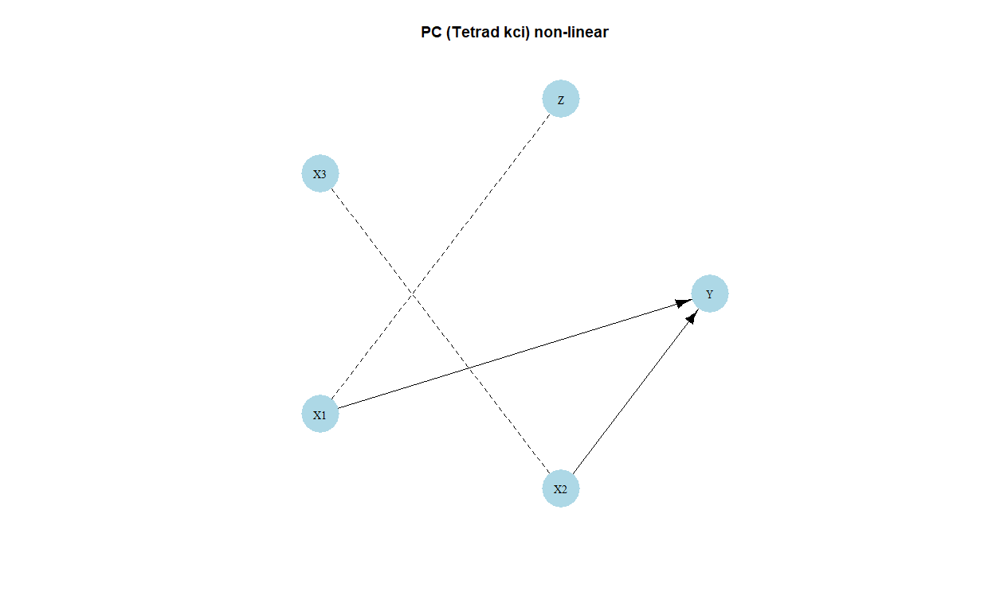

```{r, include = FALSE}
knitr::opts_chunk$set(
  collapse = TRUE,
  comment = "#>"
)
```

```{r setup}
library(causalDisco)
library(caugi)
```

This vignette provides an overview of causal discovery using simulated data.

# Example of causal discovery

Suppose we have this DAG:

```{r dag}
cg <- caugi(
  Z %-->% X1,
  X3 %-->% X2,
  X1 %-->% Y,
  X2 %-->% Y,
  class = "DAG"
)
plot(cg)
```

We can create data from a linear Gaussian model corresponding to the above DAG using `generate_dag_data()`

```{r simple causal discovery}
data_linear <- generate_dag_data(
  cg,
  n = 1000,
  seed = 1405
)
head(data_linear)
```

The R code used to generate the data is stored as an attribute of the data frame:

```{r generating model}
attr(data_linear, "generating_model")
```

We can for instance use the PC algorithm from either the "tetrad", "pcalg", or "bnlearn" engine to learn the
DAG structure from the data.
Below, we set up the PC method with Fisher's Z test, a significance level of 0.05, and use pcalg as engine.

```{r pc algorithm simple}
pc_pcalg <- pc(engine = "pcalg", test = "fisher_z", alpha = 0.05)
pc_result_pcalg <- disco(data_linear, method = pc_pcalg)
```

We can visualize the results using the `plot()` function:

```{r plot pc results simple}
plot(pc_result_pcalg, main = "PC (pcalg)")
```

The first notable feature of this plot is that some edges are directed, while others are undirected.
For example, the edge from `X1` to `Y` is directed, indicating a causal effect of `X1` on `Y`, but not in the
reverse direction. In contrast, the edge between `X2` and `X3` is undirected, indicating that the data alone do
not provide sufficient information to determine the causal direction.
Both orientations `X2 %-->% X3` and `X3 %-->% X2` are compatible with the observed conditional independencies.

We demonstrate the non-identifiability of the causal direction between `X2` and `X3` by reversing the direction
of this edge in the data-generating process above and applying the PC algorithm to the resulting data set.

```{r pc algorithm reversed}
cg_reverse <- caugi(
  Z %-->% X1,
  X2 %-->% X3,
  X1 %-->% Y,
  X2 %-->% Y
)

data_linear_reverse <- generate_dag_data(
  cg_reverse,
  n = 1000,
  seed = 1405
)

pc_result_reverse <- disco(data_linear_reverse, method = pc_pcalg)
plot(pc_result_reverse, main = "PC (pcalg) reversed")
```

We learn the same causal structure as before, demonstrating that the direction of influence between `X2` and `X3`
cannot be determined from the data alone.

## Non-linear example

Here, we simulate data with the same DAG structure as above, but with non-linear relationships between the variables.
This can again be done using `generate_dag_data()`, but we need to specify the nonlinear equations manually.

```{r non-linear causal discovery}
n <- 1000
data_nonlinear <- generate_dag_data(
  cg,
  n = n,
  Z = runif(n, min = 0, max = 6),
  X3 = runif(n, min = -2, max = 2),
  X1 = Z^2 + rnorm(n, sd = 0.5),
  X2 = sin(0.7 * X3) + rnorm(n, sd = 1),
  Y = 0.6 * X1 + 0.4 * exp(X2) + rnorm(n, sd = 1.5),
  seed = 1405
)
attr(data_nonlinear, "generating_model")
```

If we try to use the PC algorithm with Fisher's Z test again it will not perform well due to the non-linear
relationships in the data.

```{r pc algorithm non-linear}
pc_pcalg_nonlinear <- pc(engine = "pcalg", test = "fisher_z", alpha = 0.05)
pc_result_nonlinear <- disco(data_nonlinear, method = pc_pcalg_nonlinear)
plot(pc_result_nonlinear, main = "PC (pcalg) non-linear")
```

As expected, the PC algorithm with Fisher's Z test does not recover the correct causal structure in this non-linear
setting at all. Note, that increasing the sample size does not help.

To handle non-linear relationships, we can for instance use the Kernel Conditional Independence Test (KCI) test
in Tetrad.

```{r pc algorithm non-linear rcit, eval = FALSE}
if (check_tetrad_install()$installed && check_tetrad_install()$java_ok) {
  pc_tetrad_nonlinear <- pc(engine = "tetrad", test = "kci")
  pc_result_nonlinear_kci <- disco(data_nonlinear, method = pc_tetrad_nonlinear)
  plot(pc_result_nonlinear_kci, main = "PC (Tetrad kci) non-linear")
}
```



The result of the PC algorithm using the KCI test look like what we'd expect to see. Note, that this test
is much more computationally demanding than using Fisher's Z test.

# Incorporating prior knowledge

As the number of nodes increases, identifying the corresponding causal graph from observational data becomes
increasingly challenging. Incorporating prior knowledge can constrain the search space, improve the accuracy of
causal discovery, and, in particular, resolve cases where the data alone are insufficient to determine causal direction.  

Suppose we know that `v` and `w` do not cause `x`. This can be specified as follows:

```{r prior knowledge}
kn <- knowledge(
  data_linear,
  X1 %!-->% Z,  # X1 does not cause Z
  X2 %!-->% X3   # X2 does not cause X3
)
plot(kn)
```

We can then incorporate this knowledge into the PC algorithm as follows:

```{r pc algorithm with knowledge}
pc_pcalg <- pc(engine = "bnlearn", test = "fisher_z", alpha = 0.05)
pc_result_with_knowledge <- disco(data_linear, method = pc_pcalg, knowledge = kn)
plot(pc_result_with_knowledge$caugi)
```

It now correctly recovers the true DAG structure with this extra knowledge.

For more information about how to incorporate knowledge, see the
[knowledge vignette](knowledge.html).
