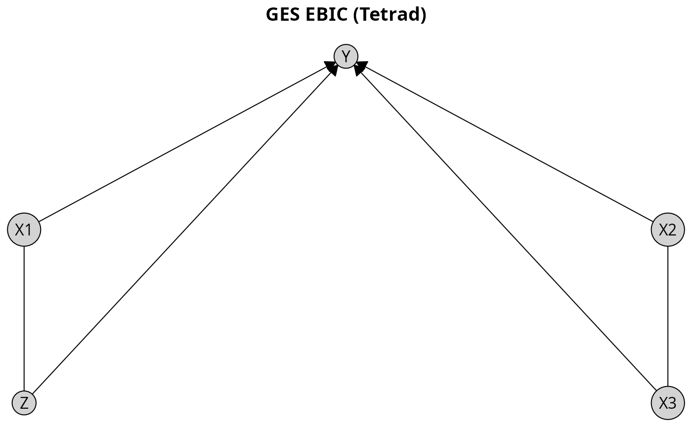

```{r, include = FALSE}
knitr::opts_chunk$set(
  collapse = TRUE,
  comment = "#>"
)
```

```{r setup}
library(causalDisco)
```

This vignette provides an overview of the causalDisco package, which offers tools for causal discovery from
observational data. It covers the main features of the package, including various causal discovery algorithms,
knowledge incorporation, and result visualization.

# Running causal discovery algorithms

We will for this section use the `num_data` dataset included in the package for demonstrating how to run causal
discovery algorithms. It contains 5 numerical variables, `X1, X2, X3, Z`, and `Y`.

```{r load data}
data(num_data)
head(num_data)
```

To make the different causal graphs easier to interpret, we define a custom fixed layout for plotting the results:

```{r}
plot_layout <- data.frame(
  name = c("Z", "X3", "X1", "X2", "Y"),
  x = c(0.00, 0.50, 0.00, 0.50, 0.25),
  y = c(0.0, 0.0, 0.5, 0.5, 1.0)
)
```

To run a causal discovery algorithm, we first define the algorithm using the corresponding function, and then pass it
to the `disco()` function along with the data. Below we demonstrate this process using the Peter-Clark (PC) algorithm
from bnlearn with Fisher's Z test:

```{r pc algorithm fisher z bnlearn}
pc_bnlearn <- pc(engine = "bnlearn", test = "fisher_z", alpha = 0.05)
pc_result_bnlearn <- disco(data = num_data, method = pc_bnlearn)
```

We can visualize the results using `plot()`:

```{r}
plot(pc_result_bnlearn, layout = plot_layout, main = "PC Fisher Z (bnlearn)")
```

The first notable feature of this plot is that some edges are directed, while others are undirected.
For example, the edge from `X1` to `Y` is directed, indicating a causal effect of `X1` on `Y`.
In contrast, the edge between `X1` and `X3` is undirected, indicating that the data alone do not provide sufficient
information to determine the causal direction.
Both orientations `X1 %-->% X3` and `X3 %-->% X1` are compatible with the observed conditional independencies.

To view all engines available for a specific algorithm, you can see the documentation using `?pc`, where all options
are listed under the `engine` argument. Instead of using bnlearn, we can also use the PC implementation from the
pcalg package with the same test:

```{r pc algorithm fisher z pcalg}
pc_pcalg <- pc(engine = "pcalg", test = "fisher_z", alpha = 0.05)
pc_result_pcalg <- disco(data = num_data, method = pc_pcalg)
plot(pc_result_pcalg, layout = plot_layout, main = "PC Fisher Z (pcalg)")
```

We see that the results using the PC algorithm implemented in bnlearn and pcalg gives the same output on this
dataset.

You can also use a different algorithm altogether, such as the GES algorithm. It follows the same pattern,
however GES is a score-based algorithm, so instead of a test and an alpha level, we need to specify a score. Below
we will use the Extended Bayesian Information Criterion (EBIC) score from Tetrad.

Tetrad is written in Java, so to use it we first need to ensure that Java is installed and that the Tetrad jar files are
available. This can be done using the `check_tetrad_install()` function. If they aren't installed, we provide the
helper functions `install_java()` and `install_tetrad()` to set them up.

```{r ges algorithm ebic tetrad, eval = FALSE}
if (check_tetrad_install()$installed && check_tetrad_install()$java_ok) {
  ges_tetrad <- ges(engine = "tetrad", score = "ebic")
  ges_result_tetrad <- disco(data = num_data, method = ges_tetrad)
  plot(ges_result_tetrad, layout = plot_layout, main = "GES EBIC (Tetrad)")
}
```
```{r ges algorithm ebic tetrad plot code, echo=FALSE, eval = FALSE}
# Code to generate the plot image
# Settings from pkgdown::fig_settings()
ragg::agg_png(
  filename = "ges-ebic-tetrad.png",
  width  = 7.291667,
  height = 4.506593,
  units  = "in",
  res    = 96 * 2   # dpi * fig.retina
)
ges_tetrad <- ges(engine = "tetrad", score = "ebic")
ges_result_tetrad <- disco(data = num_data, method = ges_tetrad)
plot(ges_result_tetrad, layout = plot_layout, main = "GES EBIC (Tetrad)")
dev.off()
```


If you want to customize the plot appearance further, you can pass additional arguments to `plot()`. For example, to
change the appearance of the nodes, you can use the `node_style` argument:

```{r custom plot}
plot(
  pc_result_bnlearn, 
  layout = plot_layout,
  main = "Customized plot",
  node_style = list(
    fill = "lightblue", # Fill color
    col = "darkblue", # Border color
    lwd = 2, # Border width
    padding = 4, # Text padding (mm)
    size = 1.2 # Size multiplier
  )
)
```

For more details on customizing plots and generating TikZ code for LaTeX documents, see the
[visualization vignette](visualization.html).

Instead of using `plot()`, another way to view and analyze the results is to use the `print()` or `summary()` functions:

```{r view results}
print(pc_result_bnlearn)
summary(pc_result_bnlearn)
```

# Incorporating knowledge

We will for this section use the dataset `tpc_example`, which contains variables, which are measured at
three different life stages: childhood, youth, and old age.

```{r}
data(tpc_example)
head(tpc_example)
```

Since we know the temporal ordering of the variables, we can incorporate this background knowledge into the causal
discovery algorithm. Specifically, we know that variables measured in childhood cannot be caused by
variables measured in youth or old age, and variables measured in youth cannot be caused by variables measured in old
age.

Knowledge is encoded by creating a `knowledge` object via the `knowledge()` function. The first argument
(optional, but recommended for name matching) specifies the dataset. Tiered knowledge can then be defined using the
`tier()` function. Here, we illustrate this by creating a tiered knowledge structure based on life stages:

```{r prior knowledge}
kn <- knowledge(
  tpc_example,
  tier(
    child ~ c("child_x1", "child_x2"),
    youth ~ starts_with("youth"), # tidyselect helper; equivalent to c("youth_x3", "youth_x4")
    oldage ~ starts_with("oldage")
  )
)
```

For more details on how to define knowledge, see the [knowledge vignette](knowledge.html).

You can view the knowledge object using `print()`, `summary()` or `plot()`:

```{r view knowledge}
print(kn)
summary(kn)
plot(kn, main = "Temporal Knowledge")
```

The plot displays vertical tiers, each enclosed in a shaded rectangle and labeled with the corresponding tier name at
the top.

We can then incorporate this knowledge into any algorithm like above. To do so, you need to pass the `knowledge` object
as an argument to the `disco()` function. Here we use the Temporal Peter-Clark (tpc) algorithm
from causalDisco with the regression-based information loss test:

```{r tpc algorithm with knowledge}
tpc_method <- tpc(engine = "causalDisco", test = "reg")
tpc_result <- disco(data = tpc_example, method = tpc_method, knowledge = kn)
```

Similarly, we can view the results using `print()`, `summary()` or `plot()`:

```{r view tpc results}
print(tpc_result)
summary(tpc_result)
plot(tpc_result, main = "TPC reg_test with Temporal Knowledge (causalDisco)")
```

Like before, the tiered knowledge is reflected in the plot layout, with variables grouped by life stage. Additionally,
you can customize the plot appearance further by passing additional arguments to `plot()`.

# Next steps

For more information about how to incorporate knowledge, see the [knowledge vignette](knowledge.html).

For more information about causal discovery, see the [causal discovery vignette](causal-discovery.html).

For more information about visualization options, see the [visualization vignette](visualization.html).
