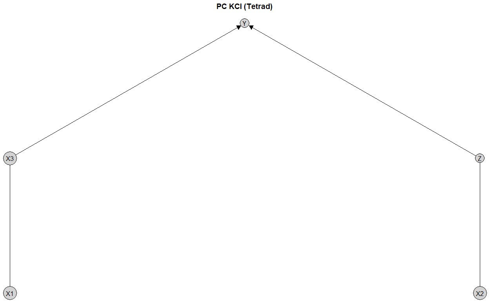

```{r, include = FALSE}
knitr::opts_chunk$set(
  collapse = TRUE,
  comment = "#>"
)
```

```{r setup}
library(causalDisco)
```

This vignette provides an overview of the causalDisco package, which offers tools for causal discovery from
observational data. It covers the main features of the package, including various causal discovery algorithms,
knowledge incorporation, and result visualization.

# Running causal discovery algorithms

We will for this section use the `num_data` dataset included in the package for demonstrating how to run causal
discovery algorithms.

```{r load data}
data(num_data)
head(num_data)

plot_layout <- data.frame(
  name = c("Z", "X3", "X1", "X2", "Y"),
  x = c(0.00, 0.50, 0.00, 0.50, 0.25),
  y = c(0.0, 0.0, 0.5, 0.5, 1.0)
)
```

We can use several algorithms from the causalDisco package to discover the causal structure from this data. Here is
an example using the Peter-Clark (PC) algorithm from Tetrad with the Kernel Conditional Independence Test (KCI).

```{r pc algorithm kci, eval = FALSE}
if (check_tetrad_install()$installed && check_tetrad_install()$java_ok) {
  pc_tetrad <- pc(engine = "tetrad", test = "kci", alpha = 0.05)
  pc_result_tetrad <- disco(num_data, method = pc_tetrad)
  plot(pc_result_tetrad, layout = plot_layout, main = "PC KCI (Tetrad)")
}
```


or the PC algorithm from bnlearn with Fisher's Z test:

```{r pc algorithm fisher z}
pc_bnlearn <- pc(engine = "bnlearn", test = "fisher_z", alpha = 0.05)
pc_result_bnlearn <- disco(num_data, method = pc_bnlearn)
plot(pc_result_bnlearn, layout = plot_layout, main = "PC Fisher Z (bnlearn)")
```

or the generalized score equivalence (GES) algorithm from pcalg with the SEM-BIC score:

```{r ges algorithm sem-bic}
ges_pcalg <- ges(engine = "pcalg", score = "sem_bic")
ges_result <- disco(num_data, method = ges_pcalg)
plot(ges_result, layout = plot_layout, main = "GES SEM-BIC (pcalg)")
```

# Incorporating knowledge

We will for this section use the dataset `tpc_example`, which contains variables measured at three different
life stages: childhood, youth, and old age. 

```{r}
data(tpc_example)
head(tpc_example)
```

Thus, we have some prior knowledge about the temporal ordering of the variables.
That is, we know the variables measured in childhood cannot be caused by variables measured in youth or old age, and
variables measured in youth cannot be caused by variables measured in old age.

This can be encoded in a `knowledge` object as follows:

```{r prior knowledge}
kn <- knowledge(
  tpc_example,
  tier(
    child ~ starts_with("child"),
    youth ~ starts_with("youth"),
    oldage ~ starts_with("oldage")
  )
)
```

You can view the knowledge object using `print()`, `summary()` or `plot()`:

```{r view knowledge}
print(kn)
summary(kn)
plot(kn, main = "Temporal Knowledge")
```

We can then incorporate this knowledge into any algorithm like above. Here we use the Temporal Peter-Clark (tpc) algorithm
from causalDisco with the regression-based information loss test:

```{r tpc algorithm with knowledge}
tpc_method <- tpc(engine = "causalDisco", test = "reg")
tpc_result <- disco(tpc_example, method = tpc_method, knowledge = kn)
```

Similarly, we can view the results using `print()`, `summary()` or `plot()`:

```{r view tpc results}
print(tpc_result)
summary(tpc_result)
plot(tpc_result, main = "TPC reg_test with Temporal Knowledge (causalDisco)")
```

# Next steps

For more information about how to incorporate knowledge, see the [knowledge vignette](knowledge.html).

For more information about causal discovery, see the [causal discovery vignette](causal-discovery.html).
