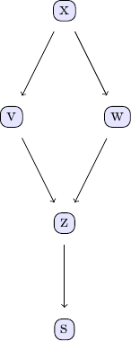
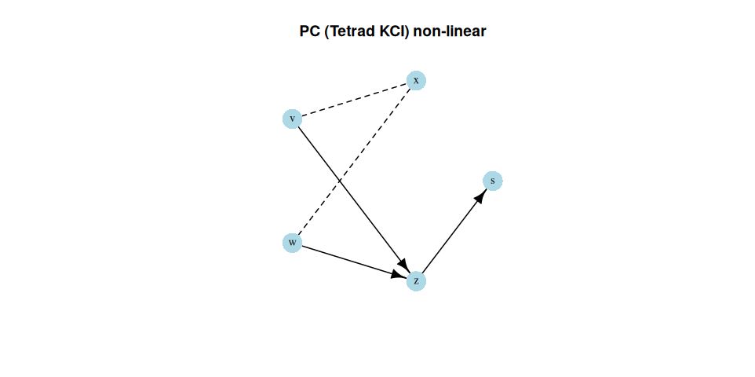

```{r, include = FALSE}
knitr::opts_chunk$set(
  collapse = TRUE,
  comment = "#>"
)
```

```{r setup}
library(causalDisco)
```

This vignette provides an overview of the `causalDisco` package, which offers tools for causal discovery from
observational data. It covers the main features of the package, including various causal discovery algorithms,
knowledge incorporation, and result visualization.

# Simple example of causal discovery

The example discussed in this section is inspired by the Julia package CausalDiscovery.jl with their PC algorithm
example, which can be found here [PC algorithm example in CausalDiscovery.jl](https://mschauer.github.io/CausalInference.jl/latest/examples/pc_basic_examples/).

We will consider data from the following DAG, which is also discussed in chapter 2 of Judea Pearl's book.



We create data from a linear Gaussian model corresponding to the above DAG:

```{r simple causal discovery}
set.seed(1405)
n <- 1000
x <- rnorm(n)
v <- x + rnorm(n) * 0.5
w <- x + rnorm(n) * 0.5
z <- v + w + rnorm(n) * 0.5
s <- z + rnorm(n) * 0.5

data_linear <- data.frame(x = x, v = v, w = w, z = z, s = s)
head(data_linear)
```

We can use the PC algorithm from either the "tetrad", "pcalg", or "bnlearn" engine to discover the causal structure.
Below, we set up the PC method with Fisher's Z test and a significance level of 0.05 and "pcalg" and "bnlearn" engines.

```{r pc algorithm simple}
pc_pcalg <- pc(engine = "pcalg", test = "fisher_z", alpha = 0.05)
pc_bnlearn <- pc(engine = "bnlearn", test = "fisher_z", alpha = 0.05)

pc_result_pcalg <- disco(data_linear, method = pc_pcalg)
pc_result_bnlearn <- disco(data_linear, method = pc_bnlearn)
```

We can visualize the results from each engine:

```{r plot pc results simple}
par(mfrow = c(1, 2))
plot(pc_result_pcalg, main = "PC (pcalg)")
plot(pc_result_bnlearn, main = "PC (bnlearn)")
par(mfrow = c(1, 1))
```

(Note, that it doesn't work correctly for bnlearn, since `as_caugi` in caugi had a bug. I fixed it in PR #149, so it will work in the next release of caugi.)

The first notable feature of this plot is that some edges have arrows, while others do not. For instance, the edge from 
`v` to `z` is directed, indicating that `v` influences `z`, but not vice versa. In contrast, the edge between 
`x` and `w` has no arrows at either end (and with dashed lines), showing that the direction of causal influence cannot be determined from the data alone. Both directions; `x` to `w` and `w` to `x`,
are consistent with the observed data. We can demonstrate this by reversing the direction of influence in the
data-generating process above and applying the PC algorithm to the new data set:

```{r pc algorithm reversed}
set.seed(1405)
n <- 1000
v <- rnorm(n)
x <- v + rnorm(n) * 0.5
w <- x + rnorm(n) * 0.5
z <- v + w + rnorm(n) * 0.5
s <- z + rnorm(n) * 0.5

data_linear_reversed <- data.frame(x = x, v = v, w = w, z = z, s = s)

pc_pcalg_reversed <- pc(engine = "pcalg", test = "fisher_z", alpha = 0.05)
pc_result_reversed <- disco(data_linear_reversed, method = pc_pcalg_reversed)
plot(pc_result_reversed, main = "PC (pcalg) reversed")
```

We learn the same causal structure as before, demonstrating that the direction of influence between `x` and `w` cannot be determined from the data alone.

## Non-linear example

Here, we simulate data the same DAG structure as above, but with a non-linear relationships between the variables.

```{r non-linear causal discovery}
set.seed(1405)
n <- 1000
x <- runif(n, min = 0, max = 2 * pi)
v <- sin(x) + rnorm(n) * 0.25
w <- cos(x) + rnorm(n) * 0.25
z <- 3 * v^2 - w + rnorm(n) * 0.25
s <- z^2 + rnorm(n) * 0.25

data_nonlinear <- data.frame(x = x, v = v, w = w, z = z, s = s)
```

If we try to use the PC algorithm with Fisher's Z test again it will not perform well due to the non-linear
relationships in the data.

```{r pc algorithm non-linear}
pc_pcalg_nonlinear <- pc(engine = "pcalg", test = "fisher_z", alpha = 0.05)
pc_result_nonlinear <- disco(data_nonlinear, method = pc_pcalg_nonlinear)
plot(pc_result_nonlinear, main = "PC (pcalg) non-linear")
```

As expected, the PC algorithm with Fisher's Z test does not recover the correct causal structure in this non-linear
setting at all. Note, that increasing the sample size does not help.

To handle non-linear relationships, we can for instance use the Kernel Conditional Independence Test (KCI) in Tetrad.

```{r pc algorithm non-linear kci, eval = FALSE}
if (check_tetrad_install()$installed && check_tetrad_install()$java_ok) {
  pc_tetrad_nonlinear <- pc(engine = "tetrad", test = "kci")
  pc_result_nonlinear_kci <- disco(data_nonlinear, method = pc_tetrad_nonlinear)
  plot(pc_result_nonlinear_kci, main = "PC (Tetrad KCI) non-linear")
}
```



The result of the PC algorithm using the KCI test look like what we'd expect to see. Note, that this test
is much more demanding than using Fisher's Z test.

# Incorporating prior knowledge

As the dimensional grows the problem of finding the corresponding graph given observational data becomes exponentially harder.
Thus, if there is any prior information available, this can help make the problem easier. We show how to incorporate
prior knowledge into the causal discovery process using the same linear data as above. Suppose we knew that
`v` and `w` do not cause `x`. This can be specified as follows:

```{r prior knowledge}
kn <- knowledge(
  data_linear,
  v %--x% x,  # v does not cause x
  w %--x% x   # w does not cause x
)
plot(kn)
```

We can then incorporate this knowledge into the PC algorithm as follows:

```{r pc algorithm with knowledge}
pc_pcalg <- pc(engine = "bnlearn", test = "fisher_z", alpha = 0.05)
pc_result_with_knowledge <- disco(data_linear, method = pc_pcalg, knowledge = kn)
plot(pc_result_with_knowledge$caugi)
```

It now correctly recovers the true DAG structure with this extra knowledge.

For more information about how to incorporate knowledge, see the
[knowledge vignette](knowledge.html).
