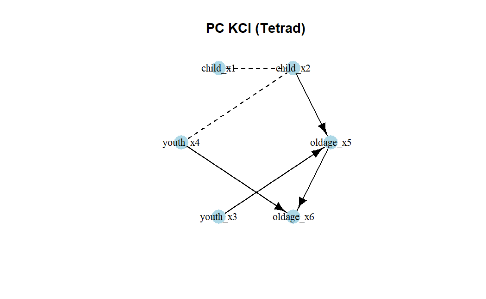

```{r, include = FALSE}
knitr::opts_chunk$set(
  collapse = TRUE,
  comment = "#>"
)
```

```{r setup}
library(causalDisco)
```

This vignette provides an overview of the causalDisco package, which offers tools for causal discovery from
observational data. It covers the main features of the package, including various causal discovery algorithms,
knowledge incorporation, and result visualization.

# Dataset

We will in this vignette use the `tpc_example` dataset available in the package. This dataset contains simulated data
from a known causal structure, with a mix of continuous and categorical variables.

```{r load data}
data("tpc_example")
# TODO change tpc_example to have child_x2 and youth_x3 as factors (or just use as numerical (or different dataset that isn't mixed))
tpc_example_cleaned <- tpc_example
tpc_example_cleaned$child_x2 <- as.factor(tpc_example_cleaned$child_x2)
tpc_example_cleaned$youth_x3 <- as.factor(tpc_example_cleaned$youth_x3)
head(tpc_example_cleaned)
```

We can use several algorithms from the `causalDisco` package to discover the causal structure from this data. Here is
an example using the test-based PC algorithm from Tetrad with the Kernel Conditional Independence Test (KCI), which can
handle both continuous and categorical variables.

```{r pc algorithm kci, eval = FALSE}
if (check_tetrad_install()$installed && check_tetrad_install()$java_ok) {
  pc_tetrad <- pc(engine = "tetrad", test = "kci", alpha = 0.05)
  pc_result_tetrad <- disco(tpc_example_cleaned, method = pc_tetrad)
  plot(pc_result_tetrad, main = "PC KCI (Tetrad)")
}
```


We can also use a score-based method like GES with the BIC score for basis-function models.

```{r ges algorithm basis function bic, eval = FALSE}
if (check_tetrad_install()$installed && check_tetrad_install()$java_ok) {
  ges_tetrad <- ges(engine = "tetrad", score = "basis_function_bic")
  ges_result_tetrad <- disco(tpc_example_cleaned, method = ges_tetrad)
  plot(ges_result_tetrad, main = "GES Basis Function BIC (Tetrad)")
}
```

...

# Incorporating knowledge

Since our dataset contains variables measured at childhood, youth, and old age, and thus the causal flow can't go
backwards in time. We can incorporate this temporal knowledge into the causal discovery process. This can be done as follows:

```{r prior knowledge}
kn <- knowledge(
  tpc_example_cleaned,
  tier(
    child ~ starts_with("child"),
    youth ~ starts_with("youth"),
    oldage ~ starts_with("oldage")
  )
)
plot(kn)
```

We can then incorporate this knowledge into the PC algorithm as follows:

```{r pc algorithm with knowledge, eval = FALSE}
if (check_tetrad_install()$installed && check_tetrad_install()$java_ok) {
  pc_tetrad <- pc(engine = "tetrad", test = "kci")
  pc_result_with_knowledge <- disco(tpc_example_cleaned, method = pc_tetrad, knowledge = kn)
  plot(pc_result_with_knowledge, main = "PC KCI with Temporal Knowledge (Tetrad)")
}
```


We can see that the resulting graph respects the temporal ordering specified in the knowledge object. We can also use
other algorithms or engines, such as the Temporal Peter-Clark (tpc) algorithm implemented in this package with 
Regression-based information loss test:

```{r tpc algorithm with knowledge}
tpc_method <- tpc(engine = "causalDisco", test = "reg")
tpc_result <- disco(tpc_example_cleaned, method = tpc_method, knowledge = kn)
plot(tpc_result, main = "TPC with Temporal Knowledge (causalDisco)")
```

# Next steps

For more information about how to incorporate knowledge, see the [knowledge vignette](knowledge.html).

For more information about causal discovery, see the [causal discovery vignette](causal-discovery.html).

TODO: Use other engines


