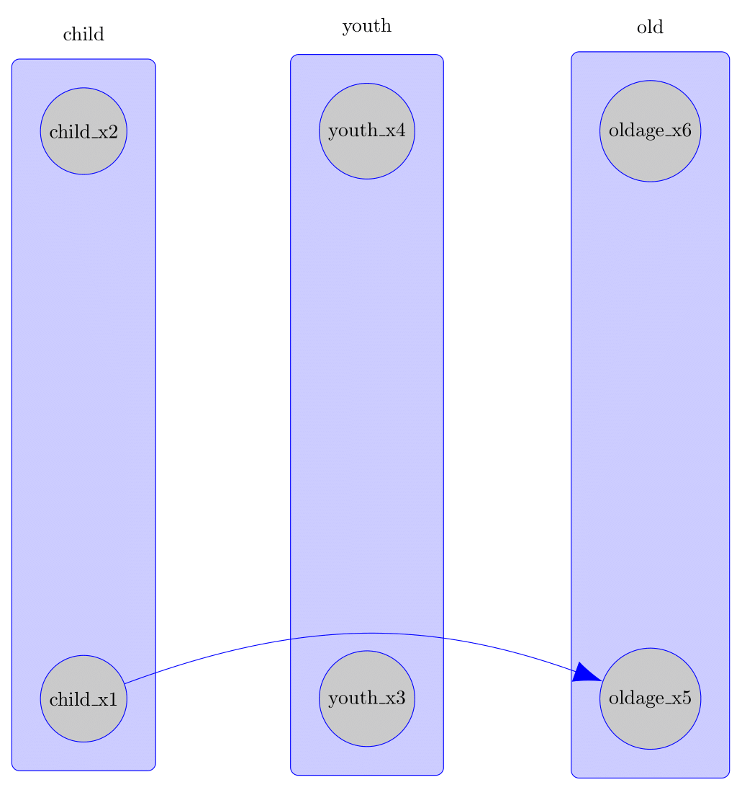

```{r, include = FALSE}
knitr::opts_chunk$set(
  collapse = TRUE,
  comment = "#>"
)
```

```{r setup}
library(causalDisco)
```

This vignette demonstrates how to visualize causal graphs. We cover plotting `Knowledge` objects and
`Disco` objects, customizing layouts and styles, and exporting graphs to readable TikZ for inclusion and
further customization in LaTeX documents.

# Plotting

You can visualize causal graphs using the `plot()` function, which works for both `Knowledge` and
`Disco` objects. The function leverages the underlying `caugi::plot()` method, providing
flexible options for customizing the appearance of nodes and edges.

## Plotting Knowledge Objects

We start by creating a simple `Knowledge` object and visualizing it with `plot()`.
This knowledge encodes the following relationships between variables in our dataset:

```{r knowledge plot}
data(num_data)
kn <- knowledge(
  num_data,
  X1 %-->% c(X2, X3), # Require edge from X1 to X2, and X1 to X3
  X2 %!-->% c(X3, Y), # Forbid edge from X2 to X3, and X2 to Y
  Y %!-->% Z  # Forbid edge from Y to Z
)

plot(kn)
```

By default, required edges are shown in blue and forbidden edges in red.
You can customize these colors using the `required_col` and `forbidden_col` arguments:

```{r knowledge plot different colors}
plot(kn, required_col = "skyblue", forbidden_col = "orange")
```

Different node layouts, node styles, and edge styles can be specified using the `layout`, `node_style`, and `edge_style`
parameters.
We provide a quick example and refer to the `causalDisco::plot()` function (and the underlying `caugi::plot()` function)
documentation for more details. Here we use the `"fruchterman-reingold"` layout and customize node and edge styles:

```{r knowledge plot custom styles}
plot(
  kn,
  layout = "fruchterman-reingold",
  node_style = list(
    fill = "lightblue", # Fill color
    col = "darkblue", # Border color
    lwd = 2, # Border width
    padding = 4, # Text padding (mm)
    size = 1.2 # Size multiplier
  ),
  edge_style = list(
    lwd = 1.5, # Edge width
    arrow_size = 4 # Arrow size (mm)
  ),
  required_col = "blue", # Color for required edges
  forbidden_col = "red" # Color for forbidden edges
)
```

Note that to override the colors for required and forbidden edges only for a specific edge, the edge needs to be
targeted explicitly in the `by_edge` list of the `edge_style` argument. For example, to make the required edge from
`X1` to `X2` orange and the forbidden edge from `X2` to `Y` yellow, while letting all other edges use the default
colors, we can do:

```{r knowledge plot edge by edge}
plot(
  kn,
  layout = "fruchterman-reingold",
  node_style = list(
    fill = "lightblue", # Fill color
    col = "darkblue", # Border color
    lwd = 2, # Border width
    padding = 4, # Text padding (mm)
    size = 1.2 # Size multiplier
  ),
  edge_style = list(
    lwd = 1.5, # Edge width
    arrow_size = 4, # Arrow size (mm)
    # Per-edge overrides
    by_edge = list(
      X1 = list(
        X2 = list(col = "orange", fill = "orange", lwd = 3)
      ),
      X2 = list(
        Y = list(col = "yellow", fill = "yellow", lwd = 3)
      )
    )
  ),
  required_col = "blue", # Color for required edges
  forbidden_col = "red" # Color for forbidden edges
)
```

You can also pass a custom layout to `plot()`:

```{r}
my_layout <- data.frame(
  name = c("X1", "X2", "X3", "Y", "Z"),
  x = c(1, 2, 3, 4, 5),
  y = c(1, 2, 1, 2, 1)
)
plot(kn, layout = my_layout)
```

### Plotting Tiered Knowledge

We can also visualize tiered knowledge structures. Here is an example using a dataset with variables measured at
different life stages:

```{r tiered knowledge plot}
data(tpc_example)
kn_tiered <- knowledge(
  tpc_example,
  tier(
    child ~ starts_with("child"), # tidyselect helper; equivalent to c("child_x1", "child_x2")
    youth ~ starts_with("youth"),
    old ~ starts_with("old")
  ),
  child_x1 %-->% child_x2,
  child_x2 %!-->% youth_x3
)
plot(kn_tiered)
```

Variables are grouped by life stage, reflecting the tiered structure. This helps visually convey temporal or
hierarchical relationships in the data.

## Plotting Knowledgeable Caugi Objects

Here we run a causal discovery algorithm to get a `Disco` object, which is the knowledge object alongside the
learned causal graph as a `caugi` object. We can then plot this combined object to see both the prior knowledge and
the learned relationships

```{r knowledgeable caugi plot}
data(num_data)
kn <- knowledge(
  num_data,
  X1 %-->% X2,
  X2 %!-->% c(X3, Y),
  Y %!-->% Z
)

pc_bnlearn <- pc(engine = "bnlearn", test = "fisher_z")
pc_result <- disco(num_data, method = pc_bnlearn, knowledge = kn)
plot(pc_result)
```

Blue edges indicate required relationships from prior knowledge, black edges show those learned from the data,
and forbidden edges are not plotted (to avoid confusion and clutter).

With tiered knowledge, the plotting works similarly:

```{r knowledgeable caugi tiered plot}
data(tpc_example)
kn_tiered <- knowledge(
  tpc_example,
  tier(
    child ~ starts_with("child"),
    youth ~ starts_with("youth"),
    old ~ starts_with("old")
  )
)
cd_tges <- tges(engine = "causalDisco", score = "tbic")
disco_cd_tges <- disco(data = tpc_example, method = cd_tges, knowledge = kn_tiered)
plot(disco_cd_tges)
```

Where we can see the tiers reflected in the layout of the graph.

# Exporting to TikZ

The `make_tikz()` function exports plots as clean, fully editable TikZ code for inclusion in LaTeX documents.

Unlike some graph export tools, edges are attached to nodes rather than positioned using hard-coded coordinates,
making the output easier to modify.

This functionality works for `Knowledge`, `Disco`, and `caugi::caugi` objects, allowing you to customize
layouts, styles, and edges further in your LaTeX document. It calls the underlying `causalDisco::plot()` method
(which calls `caugi::plot()`) to generate the initial plot object before converting it to TikZ code.
Thus, you can supply any arguments to `make_tikz()` that are supported by `causalDisco::plot()` and `caugi::plot()`.

## Exporting Knowledge to TikZ

We first demonstrate TikZ export for a `Knowledge` object.

```{r tikz export knowledge}
data(num_data)
kn <- knowledge(
  num_data,
  X1 %-->% X2,
  X2 %!-->% c(X3, Y),
  Y %!-->% Z
)

# Full standalone document
tikz_knowledge_code <- make_tikz(kn, scale = 10, full_doc = TRUE)
cat(tikz_knowledge_code)

# Only the tikzpicture environment
tikz_knowledge_snippet <- make_tikz(kn, scale = 10, full_doc = FALSE)
cat(tikz_knowledge_snippet)
```

Setting `full_doc = TRUE` generates a complete standalone LaTeX document that can be compiled directly.
Using `full_doc = FALSE` instead returns only the tikzpicture environment, which is convenient for inclusion
inside an existing LaTeX document.

The TikZ export also supports edge bending, which can substantially improve readability when edges passes thorugh other
nodes, as can easily happen in tiered knowledge structures.
This feature is not available in the standard `caugi::plot()` function. Here is an example, where the edge using the
standard straight style edge overlaps the node `youth_x3`, while the bent edge avoids this overlap:

```{r tikz bend edges}
data(tpc_example)
kn_tiered <- knowledge(
  tpc_example,
  tier(
    child ~ starts_with("child"),
    youth ~ starts_with("youth"),
    old ~ starts_with("old")
  ),
  child_x1 %-->% oldage_x5
)

plot(kn_tiered)

tikz_bent_tiered <- make_tikz(
  kn_tiered,
  scale = 10,
  full_doc = FALSE,
  bend_edges = TRUE,
  bend_angle = 20
)
cat(tikz_bent_tiered)
```

The TikZ plot can be seen here:

```{r tikz tier plot, echo=FALSE}

```

## Exporting Knowledgeable Caugi to TikZ

The output of `disco()` gives a `Disco` object, which can also be exported to TikZ:

```{r tikz export knowledgeable caugi}
data(tpc_example)
kn_tiered <- knowledge(
  tpc_example,
  tier(
    child ~ starts_with("child"),
    youth ~ starts_with("youth"),
    old ~ starts_with("old")
  )
)

tiers <- list(
  child = c("child_x1", "child_x2"),
  youth = c("youth_x3", "youth_x4"),
  old = c("oldage_x5", "oldage_x6")
)

cd_tges <- tges(engine = "causalDisco", score = "tbic")
disco_cd_tges <- disco(data = tpc_example, method = cd_tges, knowledge = kn_tiered)

disco_plot <- plot(disco_cd_tges)
tikz_snippet <- make_tikz(disco_plot, tier_node_map = tiers, scale = 10, full_doc = FALSE)
cat(tikz_snippet)
```

## Exporting Caugi Objects to TikZ

The same export mechanism also applies to standard `caugi` objects:

```{r tikz export caugi}
cg <- caugi::caugi(
  A %-->% B + C
)
plot_obj <- caugi::plot(cg, node_style = list(fill = "red"))
tikz_caugi_snippet <- make_tikz(plot_obj, scale = 10, full_doc = FALSE)
cat(tikz_caugi_snippet)
```
